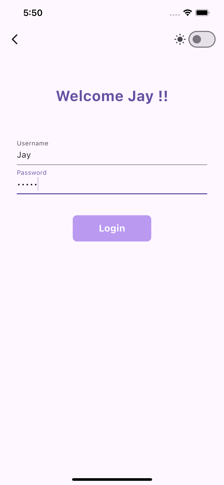
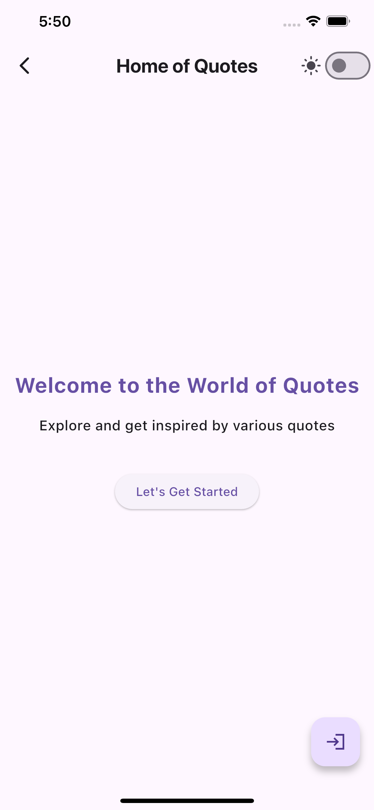
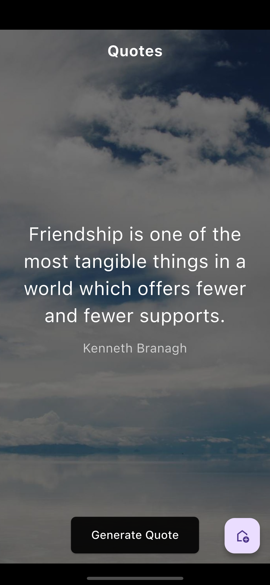
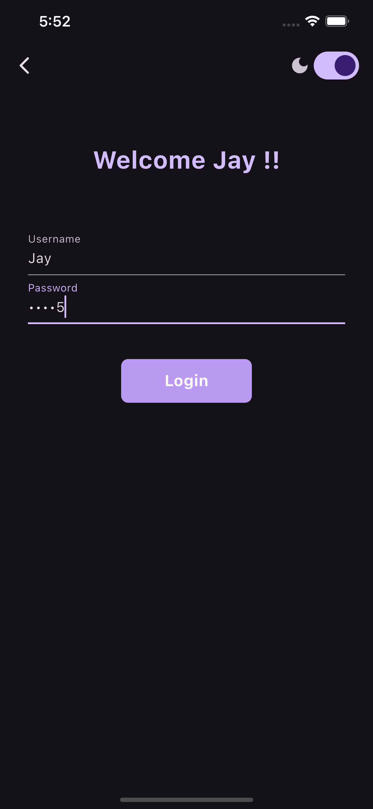
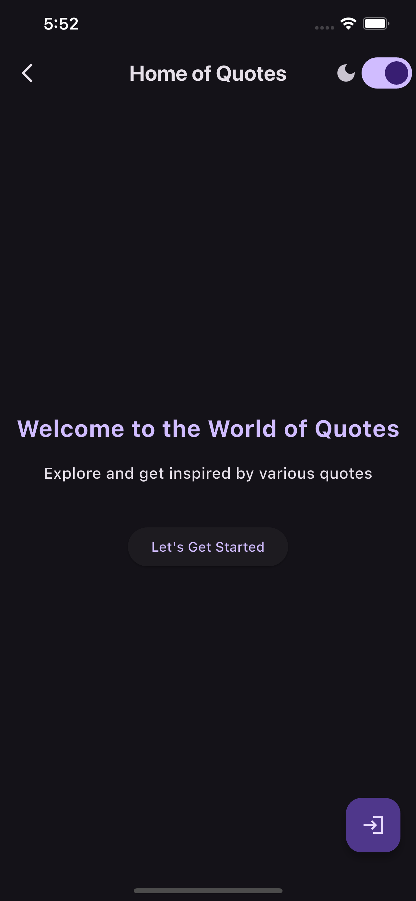
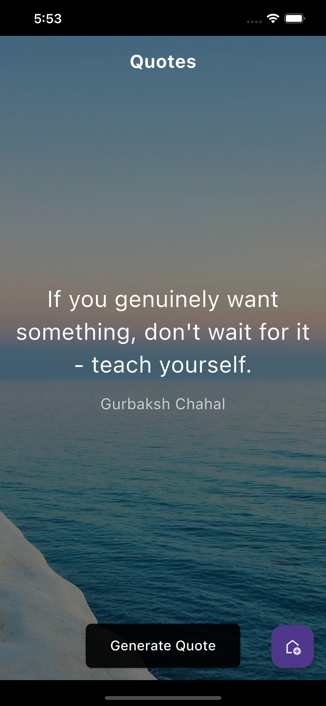

# my\_quotes\_app

**my\_quotes\_app** is a beautifully designed Flutter application that delivers **daily inspiration** through hand-picked quotes. Whether you're looking for motivation, positivity, or just a thoughtful moment, this app has you covered. The UI is sleek, responsive, and supports both **Light and Dark themes** for a smooth user experience.

---

## 📱 App Features

* 🧠 **Random Quotes**: Get a fresh, motivational quote every time you open the app.
* 🎨 **Dual Theme Support**: Enjoy clean visuals with both Light & Dark modes.
* ⚡ **Responsive UI**: Smooth navigation and visually appealing layouts.
* 🌐 **API Integration**: Quotes fetched dynamically from a public API.

---

## 📸 App Screenshots

### 🌞 Light Theme

    
   
   

---

### 🌙 Dark Theme

    
   
   

---

## 🚀 Getting Started

This project is a starting point for building a Flutter quotes application.

To get started with Flutter development:

* 📚 [Write your first Flutter app (official guide)](https://docs.flutter.dev/get-started/codelab)
* 🍳 [Cookbook: Useful Flutter samples](https://docs.flutter.dev/cookbook)
* 📖 [Flutter documentation](https://docs.flutter.dev/)

---

## 🛠️ Tech Stack

* **Flutter** – Cross-platform UI toolkit
* **Dart** – Programming language
* **REST API** – For fetching quotes

---

## 💡 Inspiration

This app was built to combine design and inspiration in one compact Flutter project. It serves as a great starting point for beginners learning how to integrate APIs, manage themes, and build beautiful UIs.

